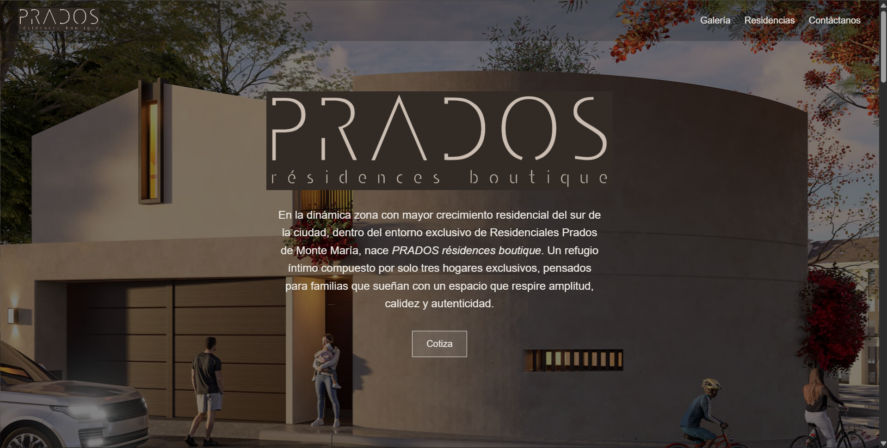
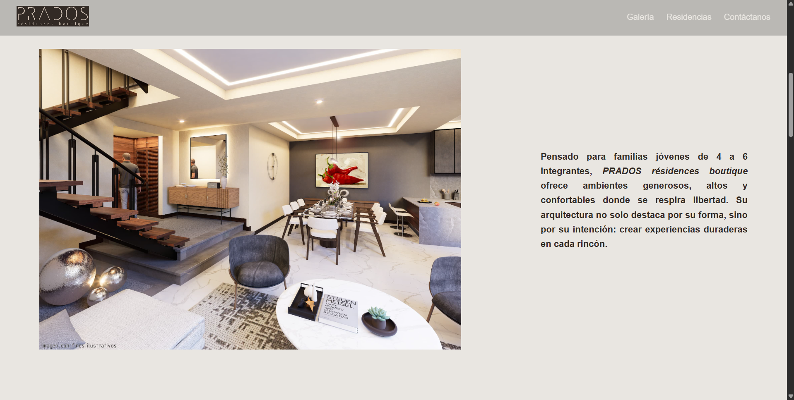
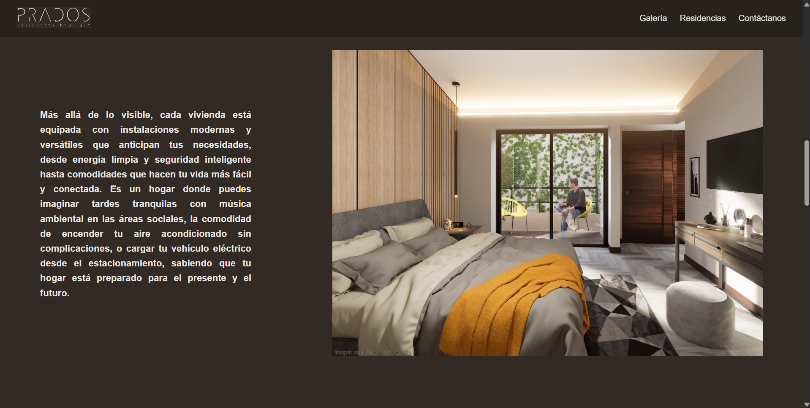
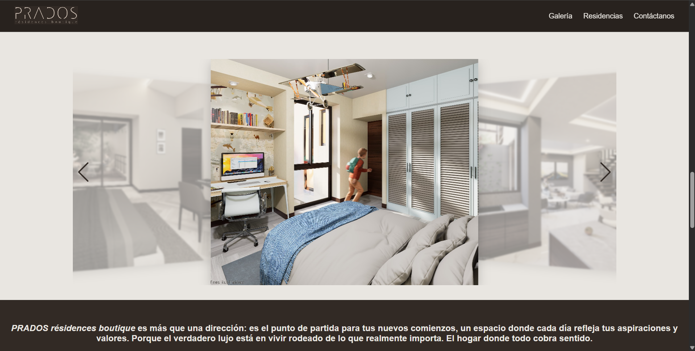
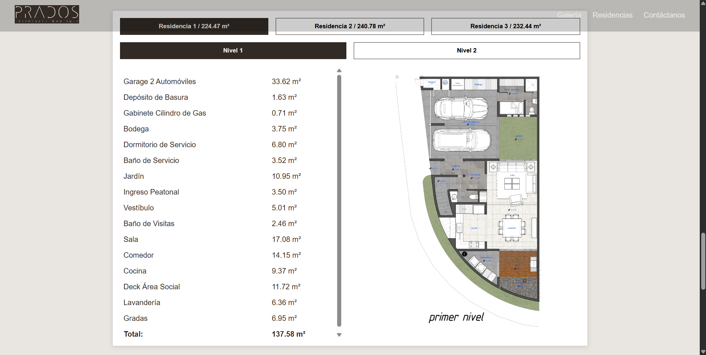
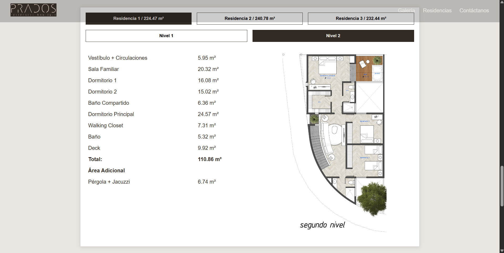
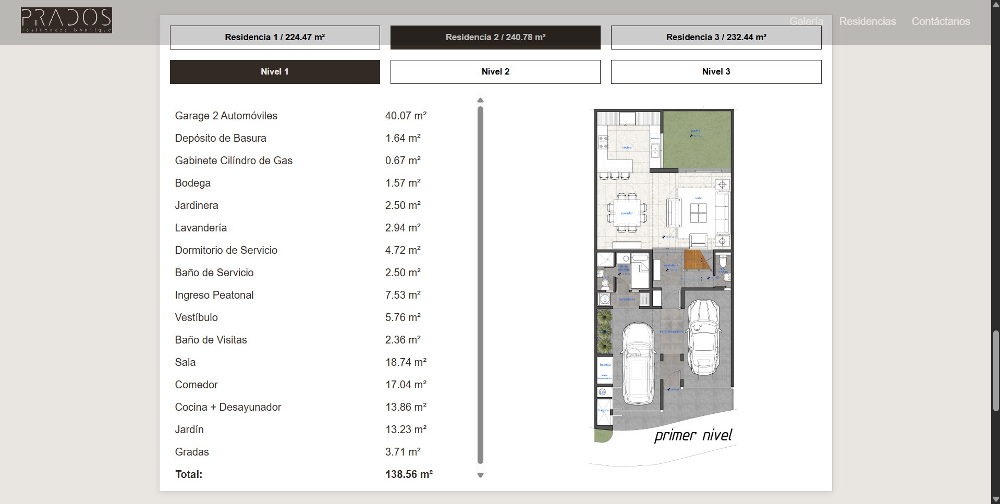
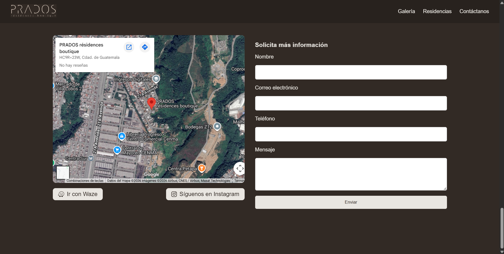

# PRADOS résidences boutique


Landing page desarrollada para **Vector Inmobiliario** con el objetivo de promocionar el proyecto residencial **PRADOS résidences boutique**. La aplicación presenta información sobre las residencias disponibles, amenidades, ubicación y planos, incorporando además un formulario de contacto con envío de correos electrónicos para la captación de clientes potenciales.



---

## Contexto

Este proyecto fue desarrollado para un cliente del sector inmobiliario. Aunque el desarrollo fue completado, la página nunca llegó a publicarse debido a la cancelación del proyecto inmobiliario.

---

## Características principales

- Landing page completamente responsive.
- Hero principal con carrusel de imágenes.
- Sección informativa del proyecto residencial.
- Galería de imágenes.
- Visualización dinámica de planos por residencia y nivel.
- Información detallada sobre modelos de residencias.
- Sección de amenidades.
- Formulario de contacto con envío de correos electrónicos.
- Integración con Google Maps, Waze e Instagram.

---

## Tecnologías

### Backend

- Node.js 20.20.2
- Express 5
- EJS
- Nodemailer

### Frontend

- HTML5
- CSS3
- JavaScript
- Swiper.js
- Font Awesome

### Herramientas

- dotenv
- body-parser
- npm

---

## Capturas de pantalla

### Página principal


### Sección de Información




### Galería



### Menú de residencias





### Formulario de contacto



---

## Configuración

Antes de ejecutar el proyecto es necesario crear un archivo `.env` en la raíz del proyecto con las credenciales del servicio de correo electrónico utilizadas por el formulario de contacto.

### Ejemplo

```env
PORT=3000

EMAIL_SERVICE=gmail
EMAIL_USER=tu_correo@gmail.com
EMAIL_PASS=tu_contraseña_de_aplicacion
EMAIL_TO=destinatario@gmail.com
```

---

## Instalación

1. Clonar el repositorio.

```bash
git clone https://github.com/jptorresg/PRADOS-residences-boutique.git
```

2. Ingresar al directorio del proyecto.

```bash
cd PRADOS-residences-boutique
```

3. Instalar las dependencias.

```bash
npm install
```

4. Configurar el archivo `.env`.

5. Iniciar el servidor.

```bash
npm start
```

6. Acceder a la aplicación desde:

```
http://localhost:3000
```

---

## Estructura del proyecto

```text
.
├── public/
│   ├── styles.css
│   ├── scripts/
│   └── images/
├── views/
│   └── index.ejs
├── .env
├── package.json
├── package-lock.json
└── server.js
```

---

## Autor

Juan Pablo Torres

- GitHub: <https://github.com/jptorresg>
- LinkedIn: <https://www.linkedin.com/in/juan-pablo-torres-g>

---

## Licencia

Este proyecto fue desarrollado para un cliente con fines comerciales y actualmente se comparte únicamente como parte del portafolio del autor.

El uso comercial, la redistribución o la reutilización de este código requieren la autorización expresa del autor y del cliente.
